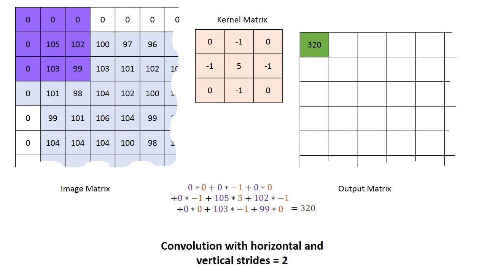
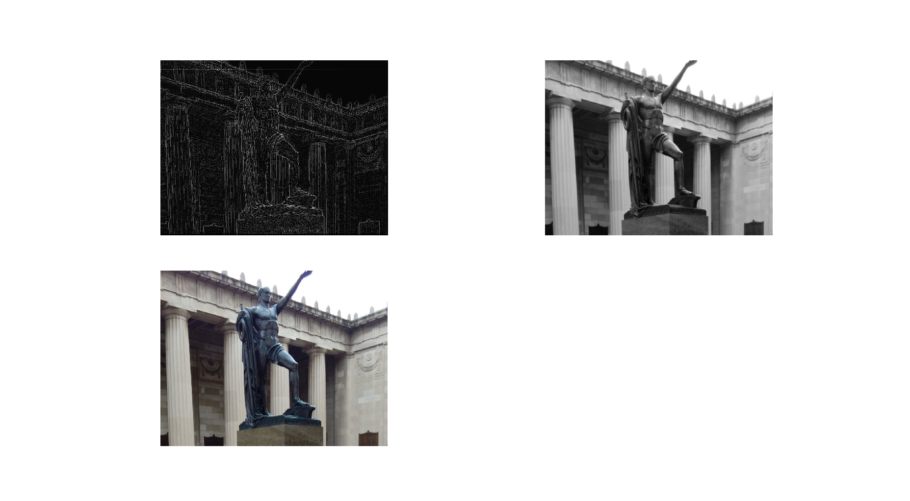

Undrestanding Convolutional Layers in Convolutional Neural Networks (CNNs)
--------------------------------------------------------------------------

A comprehensive tutorial towards 2D Convolutional layers

Introduction
------------

2D Convolutional Layers constitute Convolutional Neural Networks (CNNs)
along with Pooling and fully-connected layers and create the basis of
deep learning. So if you want to go deeper into CNNs and deep learning,
the first step is to get more familiar with how Convolutional Layers
work. If you are not familiar with applying 2D filters on images, we
urgely suggest you to first have a look at our previous post about image
filtering [here](image_convolution_1.html). In the [image
filtering](image_convolution_1.html) post, we talked about convolving a
filter with an image. In that post, we had a 2D filter kernel (a 2D
matrix) and a single channel image (grayscale image). To calculate the
convolution, we swept the kernel (if you remember we should flip the
kernel first and then do the convolution, for the rest of this post we
assumed that the kernel is already flipped) on the image and at every
single location we calculated the output. In fact, the **stride** of our
convolution was 1. You might say what is a stride? **stride** is the
number of pixels with which we slide our filter, horizontally or
vertically. In other words, in that case we moved our filter one pixel
at each step to calculate the next convoluion output. However, for a
convolution with stride 2, we calculate the output for every other pixel
(or jump 2 pixels) and as a contrary the output of the convolution would
be roughly half the size of the input image. Figure 1 compares two 2D
convolutions with strides one and two, respectively.




Note that ,you can have different strides horizontally and vertically.
You can use the following equations to calculate the exact size of the
convolution output for an input with the size of (width = \$W\$, height
= \$H\$) and a Filter with the size of (width = \$F\_w\$, height =
\$F\_h\$):

output width = \\dfrac{W-F\_w+2P}{S\_w}+1

output height = \\dfrac{H-F\_h+2P}{S\_h}+1

where \$s\_w\$ and \$s\_h\$ are horizontal and vertical stride of the
convolution, respectively, and \$P\$ is the amount of zero padding added
to the border of the image (Look at the [previous post]() if you are not
familiar with the zero padding concept). However, the output width or
height calculated from these equations might be a non-integer value. In
that case, you might want to handle the situation in any way to satisfy
the desired output dimention. Here, we explain how **Tensorflow**
approachs the issue. In general you have two main options for padding
scheme which determine the output size, namely **'SAME'** and
**'VALID'** padding schemes. In 'SAME' padding scheme, in which we have
zero padding, the size of output will be

output height = ceil(\\dfrac{H}{S\_h})
output width = ceil(\\dfrac{W}{S\_w})

If the required number of pixels for padding to have the desired output
size is a even number, we can simply add half of that to each side of
the input (left and rigth or up and bottom). However, if it is an odd
number, we need an uneven number of zero on the left and the right sides
of the input (for horizontal padding) or the top and the bottom sides of
the input (for vertical padding). Here is how Tensorflow calculates
required padding in each side:

padding along height = P\_h = max((output height-1)\*S\_h + F\_h - H, 0)

padding along width = P\_w = max((output width-1)\*S\_w + F\_w - W, 0)

padding top = P\_t = Floor(\\dfrac{P\_h}{2})
padding left = P\_l = Floor(\\dfrac{P\_w}{2})

text{padding bottom} = P\_h - P\_t \\qquad \\qquad \\text{padding
right} = P\_w - P\_l

Similarly, in the 'VALID' padding scheme which we do not add any zero
padding to the input, the size of the output would be

text{output height} = ceil(\\dfrac{H-F\_h+1}{S\_h})
text{output width} = ceil(\\dfrac{W-F\_w+1}{S\_w})

Let's get back to the Convolutional layer. A convolution layer does
exactly the same: applying a filter on an input in convolutionl manner.
Likewise Fully-Connected layers, a Convolutional layer has a weight,
which is its kernel (filter), and a bias. But in contrast to the
fully-connected layers, in convolutional layers each pixel (or neuron)
of the output is connected to the input pixels (neurons) locally instead
of being connected to all input pixels (neurons). Hence, we use the term
of **receptive field** for the size of convolutional layer's filter.

Bias in a convolutional layer is a unique scalar value which is added to
the output of Convolutional Layer's filter at every single pixel. What
we talked about so far, was in fact a Convolutional layer with 1 input
and 1 output **channel** (also known as **depth**) and a zero bias.
Generally, a convolution layer can have multiple input channels (each a
2D matrix) and multiple output channels (again each a 2D matrix). Maybe
the most tangible example of a multi-channel input is when you have a
color image which has 3 RGB channels. Let's get it to a convolution
layer with 3 input channels and 1 output channel. How is it going to
cacluate the output? A short answer is that it has 3 filters (one for
each input) instead of one input. What it does is that it calculates the
convolution of each filter with its corresponding input channel (First
filter with first channel, second filter with second channel and so on).
The stride of all channels are the same, so they output matrices with
the same size. Now, it sum up all matrices and output a single matrix
which is the only channel at the output of the convolution layer. For
better underestanding, you can have a look at Figure 2.


Let's modify our convolution code in the previous post and make a 2D
Convolutional Layer:


```python
import matplotlib.pyplot as plt
from scipy import misc
import numpy as np
from skimage import exposure
from math import ceil


def convolution2d(conv_input, conv_kernel, bias=0, strides=(1, 1), padding='same'):
    # This function which takes an input (Tensor) and a kernel (Tensor)
    # and returns the convolution of them
    # Args:
    #   conv_input: a numpy array of size [input_height, input_width, input # of channels].
    #   conv_kernel: a numpy array of size [kernel_height, kernel_width, input # of channels]
    #                represents the kernel of the Convolutional Layer's filter.
    #   bias: a scalar value, represents the bias of the Convolutional Layer's filter.
    #   strides: a tuple of (convolution vertical stride, convolution horizontal stride).
    #   padding: type of the padding scheme: 'same' or 'valid'.
    # Returns:
    #   a numpy array (convolution output).

    assert len(conv_kernel.shape) == 3, "The size of the kernel should be (kernel_height, kernel_width, input # of channels)"
    assert len(conv_input.shape) == 3, "The size of the input should be (input_height, input_width, input # of channels)"
    assert conv_kernel.shape[2] == conv_input.shape[2], "the input and the kernel should have the same depth."

    input_w, input_h = conv_input.shape[1], conv_input.shape[0]      # input_width and input_height
    kernel_w, kernel_h = conv_kernel.shape[1], conv_kernel.shape[0]  # kernel_width and kernel_height

    if padding == 'same':
        output_height = int(ceil(float(input_h) / float(strides[0])))
        output_width = int(ceil(float(input_w) / float(strides[1])))

        # Calculate the number of zeros which are needed to add as padding
        pad_along_height = max((output_height - 1) * strides[0] + kernel_h - input_h, 0)
        pad_along_width = max((output_width - 1) * strides[1] + kernel_w - input_w, 0)
        pad_top = pad_along_height // 2             # amount of zero padding on the top
        pad_bottom = pad_along_height - pad_top     # amount of zero padding on the bottom
        pad_left = pad_along_width // 2             # amount of zero padding on the left
        pad_right = pad_along_width - pad_left      # amount of zero padding on the right

        output = np.zeros((output_height, output_width))  # convolution output

        # Add zero padding to the input image
        image_padded = np.zeros((conv_input.shape[0] + pad_along_height,
                                 conv_input.shape[1] + pad_along_width, conv_input.shape[2]))
        image_padded[pad_top:-pad_bottom, pad_left:-pad_right, :] = conv_input

        for x in range(output_width):  # Loop over every pixel of the output
            for y in range(output_height):
                # element-wise multiplication of the kernel and the image
                output[y, x] = (conv_kernel * image_padded[y * strides[0]:y * strides[0] + kernel_h,
                                x * strides[1]:x * strides[1] + kernel_w, :]).sum() + bias

    elif padding == 'valid':
        output_height = int(ceil(float(input_h - kernel_h + 1) / float(strides[0])))
        output_width = int(ceil(float(input_w - kernel_w + 1) / float(strides[1])))

        output = np.zeros((output_height, output_width))  # convolution output

        for x in range(output_width):  # Loop over every pixel of the output
            for y in range(output_height):
                # element-wise multiplication of the kernel and the image
                output[y, x] = (conv_kernel * conv_input[y * strides[0]:y * strides[0] + kernel_h,
                                x * strides[1]:x * strides[1] + kernel_w, :]).sum() + bias

    return output

# load the image as RGB (3 channels)
img = misc.imread('image.png', mode='RGB')

# The edge detection kernel
kernel = np.array([[-1, -1, -1], [-1, 8, -1], [-1, -1, -1]])[..., None]
kernel = np.repeat(kernel, 3, axis=2)

# Convolve image and kernel
image_edges= convolution2d(img, kernel)

# Plot the filtered image
plt.imshow(image_edges, cmap=plt.cm.gray)
plt.axis('off')
plt.show()

# Adjust the contrast of the filtered image by applying Histogram Equalization
image_edges_equalized = exposure.equalize_adapthist(image_edges / np.max(np.abs(image_edges)),
                                                      clip_limit=0.03)
plt.imshow(image_edges_equalized, cmap=plt.cm.gray)
plt.axis('off')
plt.show()
```
What about when the convolution layer has more than one output channels.
In that case, the layer has a different multi-channel filter (the number
of its channel is equal to the number of input channels) to calculate
each output. For example, assume we have a layer with three input
channels (RGB) and five output channels. This layer would have 5
filters, and 3 channels per filter. It uses each filter (3 channels) to
compute the corresponding output from the input channels. In other
words, it uses the first 3-channel filter to calculate the first channel
of the output and so on. Note that each output channel has its own bias.
Therefore, the number of biases in each Convolutional layer is equal to
the number of output channels. Now, let's modify the previous code to
handle more than one channel at output.


```python
import matplotlib.pyplot as plt
from scipy import misc
import numpy as np
from skimage import exposure
from math import ceil


def convolution2d(conv_input, conv_kernel, bias, strides=(1, 1), padding='same'):
    # This function which takes an input (Tensor) and a kernel (Tensor)
    # and returns the convolution of them
    # Args:
    #   conv_input: a numpy array of size [input_height, input_width, input # of channels].
    #   conv_kernel: a numpy array of size [kernel_height, kernel_width, input # of channels, 
    #         output # of channels] represents the kernel of the Convolutional Layer's filter.
    #   bias: a numpy array of size [output # of channels], represents the bias of the Convolutional
    #         Layer's filter.
    #   strides: a tuple of (convolution vertical stride, convolution horizontal stride).
    #   padding: type of the padding scheme: 'same' or 'valid'.
    # Returns:
    #   a numpy array (convolution output).

    assert len(conv_kernel.shape) == 4, "The size of kernel should be (kernel_height, kernel_width, input # of channels, output # of channels)"
    assert len(conv_input.shape) == 3, "The size of input should be (input_height, input_width, input # of channels)"
    assert conv_kernel.shape[2] == conv_input.shape[2], "the input and the kernel should have the same depth."

    input_w, input_h = conv_input.shape[1], conv_input.shape[0]      # input_width and input_height
    kernel_w, kernel_h = conv_kernel.shape[1], conv_kernel.shape[0]  # kernel_width and kernel_height
    output_depth = conv_kernel.shape[3]

    if padding == 'same':
        output_height = int(ceil(float(input_h) / float(strides[0])))
        output_width = int(ceil(float(input_w) / float(strides[1])))

        # Calculate the number of zeros which are needed to add as padding
        pad_along_height = max((output_height - 1) * strides[0] + kernel_h - input_h, 0)
        pad_along_width = max((output_width - 1) * strides[1] + kernel_w - input_w, 0)
        pad_top = pad_along_height // 2             # amount of zero padding on the top
        pad_bottom = pad_along_height - pad_top     # amount of zero padding on the bottom
        pad_left = pad_along_width // 2             # amount of zero padding on the left
        pad_right = pad_along_width - pad_left      # amount of zero padding on the right

        output = np.zeros((output_height, output_width, output_depth))  # convolution output

        # Add zero padding to the input image
        image_padded = np.zeros((conv_input.shape[0] + pad_along_height,
                                 conv_input.shape[1] + pad_along_width, conv_input.shape[2]))
        image_padded[pad_top:-pad_bottom, pad_left:-pad_right, :] = conv_input

        for ch in range(output_depth):
            for x in range(output_width):  # Loop over every pixel of the output
                for y in range(output_height):
                    # element-wise multiplication of the kernel and the image
                    output[y, x, ch] = (conv_kernel[..., ch] * 
                                     image_padded[y * strides[0]:y * strides[0] + kernel_h,
                                     x * strides[1]:x * strides[1] + kernel_w, :]).sum() + bias[ch]

    elif padding == 'valid':
        output_height = int(ceil(float(input_h - kernel_h + 1) / float(strides[0])))
        output_width = int(ceil(float(input_w - kernel_w + 1) / float(strides[1])))

        output = np.zeros((output_height, output_width, output_depth))  # convolution output

        for ch in range(output_depth):
            for x in range(output_width):  # Loop over every pixel of the output
                for y in range(output_height):
                    # element-wise multiplication of the kernel and the image
                    output[y, x, ch] = (conv_kernel[..., ch] * 
                                     conv_input[y * strides[0]:y * strides[0] + kernel_h,
                                     x * strides[1]:x * strides[1] + kernel_w, :]).sum() + bias[ch]

    return output

# load the image
img = misc.imread('image2.jpg', mode='RGB')

# The edge detection kernel
kernel1 = np.array([[-1, -1, -1], [-1, 8, -1], [-1, -1, -1]])[..., None]
kernel1 = np.repeat(kernel1, 3, axis=2)

# The blur kernel
kernel2 = np.array([[1, 1, 1], [1, 1, 1], [1, 1, 1]])[..., None]/9.0
kernel2 = np.repeat(kernel2, 3, axis=2)

kernel = np.zeros_like(kernel1, dtype=np.float)[..., None]
kernel = np.repeat(kernel, 2, axis=3)
kernel[..., 0] = kernel1
kernel[..., 1] = kernel2

# Convolve image and kernel
image_edges = convolution2d(img*255, kernel, bias=[1, 0])

# Adjust the contrast and plot the first channel of the output
image_edges_equalized = exposure.equalize_adapthist(image_edges[..., 0] / 
                                 np.max(np.abs(image_edges[..., 0])), clip_limit=0.03)
plt.figure(1)

# Plot the first channel of the output
plt.subplot(221)
plt.imshow(image_edges_equalized, cmap=plt.cm.gray)
plt.axis('off')

# Plot the second channel of the output
plt.subplot(222)
plt.imshow(image_edges[..., 1], cmap=plt.cm.gray)
plt.axis('off')

# Plot the input
plt.subplot(223)
plt.imshow(img, cmap=plt.cm.gray)
plt.axis('off')
plt.show()
```
To test the code, we created an convolutional layer which has two
filters. A edge detection filter on all 3 channels and a blur filter.



In brief, **stride**, **zero-padding**, and the **depth** determine the
spatial size of the output in a convolutional layer. The depth in fact
is a hyperparameter which is set by who is designing the network
(including the convolutional layer) and is equal to the number of
filters you want to use. Each filter would be desired to learn different
property or aspect of an image.

Even though we almost covered the overal opertaion of a convolutional
layer, we are not done yet. Similar to a fully-connected layer, the
output of a convolutional layer usually pass to an elementwise
activation function. The activation function helps to add nonlinearity
to the network as a pure convolution is a linear operation in
Mathematics point of view. One of the most common activation functions
in the area of deep learning is **RELU** which is defined as:

<p align="center"></p>

If you want to add RELU to our latest version of convolutional layer,
you just need to replace `return output` with
`return np.maximum(output, 0)`

Good to know 
------------

Know that you know how a convolutional layer works, it's time to cover
some usefull details:

-   **Number of parameters:** When you are designing your network,
    number of trainable parameters significantly matters. Therefore, it
    is good to know how many parameters your convolutional layer would
    add up to your network. What you train in a convolutional layer are
    its filters and biases. Then, you can easily calculate its number of
    parameters using the following equation:


    where $d_i$, and $d_o$ are depth (\# of channels) of the input
    and depth of the output, respectively. Note that the one inside the
    parenthesis is to count the biases.
-   **Locally-Connected Layer:** This type of layer is quite the same as
    the Convolutional layer explained in this post but with only one
    (important) difference. In the Convolutional layer the filter was
    common among all output neurons (pixels). In other words, we used a
    single filter to calculate all neurons (pixels) of an output
    channels. However, in Locally-Connected Layer each neuron (pixel)
    has its own filter. It means the number of parameters will be
    multiplied by the number of output neurons. It drastically could
    increase the number of parameters and if you do not have enough
    data, you might end up with an over-fitting issue. However, this
    type of layer let your network to learn different types of feature
    for different regions of the input. Researchers, got benefit of this
    helpful property of Locally-Connected Layers specially in face
    verification such as
    [DeepFace](http://www.cv-foundation.org/openaccess/content_cvpr_2014/papers/Taigman_DeepFace_Closing_the_2014_CVPR_paper.pdf)
    and [DeepID3](https://arxiv.org/abs/1502.00873). Still, some other
    researchers use a distinct filter for each region of the input
    instead of each neuron (pixel) to get benefit of Locally-Connected
    Layers with less number of parameters.
-   **Convolution layers with 1X1 filter size:** Even though using a 1X1
    filter does not make sense at first glance in image processing point
    of view, it can help by adding nonlinearity to your network. In
    fact, a 1X1 filter calculate a linear combination of all
    corresponding pixels (nuerons) of the input channels and output the
    result through an activation function which adds up the
    nonlinearity.

**What Next?** In the next post we will get more familiar with
backpropagation and how to train a convolutional neural network.
