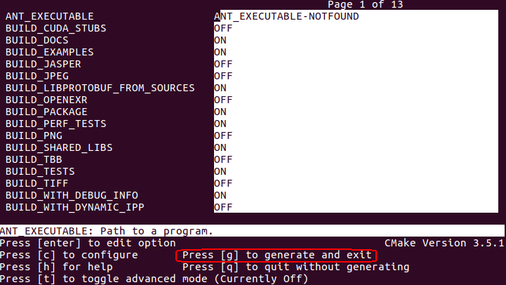

OpenCV Anaconda installation in Ubuntu
--------------------------------------

This tutorial deals with OpenCV 3.1 installation for Anaconda in Ubuntu
16.04.

Introduction
------------

**OpenCV 3.1** has been developed as the newest version of OpenCV
library and it's been widely used so far. **Anacaconda** has a pretty
nice easy-to-use environment in which almost all the necessary Python
packages are installed and it is rapidly growing. Although OpenCV
installation for anaconda has been compiled but it has different issues
when it comes to integrate it with ubuntu specially if one needs to have
its complete features and specially the video support. For having the
all features of OpenCV, it needs to be installed from the source.

There are few anaconda installations guide for OpenCV 3.1 but still it
seems to be a tricky problem specially when using virtual environments
is desired. There might be a misunderstanding about the naming
convention of OpenCV3 which is its relevance to Python3 which is wrong.
OpenCV3(version 3.1 as an example) works with both Python generations
like **Python 2.7** and **Python 3.5** in the same way. However in this
tutorial the Python3 is considered as a more recent choice by the
programmers. Unless otherwise mentioned, the assumption is that all the
commands will be executed in the `Root`
directory. From any other directories, by using the `cd \~` command we go to the root directory.

Virtual Environment
-------------------

In this section the method for creating the virtual environment in
Anaconda will be described. One may ask how to create Python virtual
environments rather than the Anaconda virtual environments. There is
nice documentation about [Python Virtual
Environments](http://docs.astropy.org/en/stable/development/workflow/virtual_pythons.html)
in the hyperlink however it is related to Python environment itself.
Creating virtual environment in Anaconda is much easier though.

### Advantages of Working on Virtual Environments {#virtual-advantages}

The main advantage of using virtualenvs is to separate different
projects environments in which using different Python versions or
packages are desired. For illustration let's assume some packages have
conflict and also both are required for different separated projects. In
this manner, different projects can be developed in different
environments and here's the virtual environments come to our rescue.
Moreover creating virtual environments enrich the user with creating a
new environment so not to corrupt any of the root packages. There is
another strong point. Installing packages and managing the conflicts in
virtual environments is much easier than the general environment because
from the beginning the procedure of installing dependencies is at hand.

### Creating Virtual Environments {#virtual-creation}

Although creating virtual environments in anaconda is very easy, however
there exits some considerations and a procedure for sure!

#### Step\#1: Check Installation

First of all, Anaconda has to be in the `PATH`. Type the following in the
terminal to do so:

```shell
export PATH="PATH=/home/username/anaconda/bin:\$PATH"
```

The element of "username" is specific to the system. Now you can check
if the Anaconda is in the path or not with checking the full PATH by
using following command:

```shell
echo $PATH
```

More over the installed Conda version can be checked to make sure the
Anaconda is already installed and is updated.

```shell
conda update conda
conda info
```

After verifying the installation, the next step is to create the virtual
environment with the desired command.
#### Step\#2: Creating Virtual Environment

For Installing *Python 3.5* in the Anaconda virtualenv, the following
command should be executed in the command line.

```shell
conda create -n Virtualenv\_Name python=3.5 anaconda
```

The `Virtualenv\_Name`is the associated
name for the virtual environment. Different Python versions can be
installed by just changing the version number assigned in the command.
The virtual environment is chosen to be `py3k` for our distribution.

#### Step\#3: Activate Environment

The next step is to activate environment. After activation, all packages
will be installed within the virtual environment and the workflow will
be executed there too. The command to activate the virtual environment
named *py3k* is as follows:

```shell
 source activate py3k
```

After the activation, the sign of the environment should appear in the
command line. The screen will be something similar to the below image:

<p align="center">
  <b>Some Links:</b><br>
  <a href="#">Link 1</a>
  <br><br>
  
</p>


*There is a caveat for working in virtual environments*. Although the
workspace is the virtual environment, if the user apply ```Sudo``` command for any installation, the
process will target the system root and not the virtual environment.
This point is crucial because it is common mistake and cannot be easily
recognized.
#### Step\#4: Deactivation

For deactivating the virtual environment the following command can
simply be employed:

```shell
source deactivate
```

Installing dependencies
-----------------------

Loosely speaking, installing the dependencies is the main part of OpenCV
installation. The reason is OpenCV requires a lot of packages to be
installed. So the system architecture must provide every single
dependencies that it needs. moreover if installing extra OpenCV modules
is desired, it certainly adds to the number of requirements. This
section is aimed to describe what are these requirements.

### I - System Update

First of all, the system packages should be updated to their latest
version. `sudo apt-get update` downloads
the package lists from the repositories and "updates" them to get
information on the newest versions of packages and their dependencies.
`sudo apt-get upgrade` will fetch new
versions of packages existing on the machine if APT knows about these
new versions by way of apt-get
update\[[Reference](http://askubuntu.com/questions/222348/what-does-sudo-apt-get-update-do)\].

```shell
sudo apt-get update
sudo apt-get upgrade
```

Building tools must be installed first. The `build-essentials` is a reference for any
Debian package requirements. It generally includes the gcc/g++ compilers
as libraries and is necessary if any C/C++ compiler is included in the
requirements. If any packages is desired to be compiled from it source
then `pkg-config` is required which is
our case in OpenCV installation. `cmake` manages and execute the build process of OpenCV. `cmake-curses-gui` installs the **ccmake**
which is the handy GUI for the cmake configuration process!

```shell
sudo apt-get install build-essential pkg-config cmake cmake-curses-gui
```

### II - Installing Python libraries

Of course python is required for installing OpenCV. Moreover installing
some famous packages as `Numpy` and
`Scipy` is of great important for any
computer vision library. `python-dev`
basically contains the header files which are necessary to build Python
extensions.

```shell
sudo apt-get install python-dev python-numpy
sudo apt-get install python-scipy
```

### III - Installing GUI libraries

OpenCV employs the HighGUI library("high-level graphical user
interface") to open windows, display, read and write images and videos
and etc. This library(HighGUI) needs a backend to operate. There are two
available backend for HighGUI. One is the `Qt` library which can be installed as
follows:

```shell
sudo apt-get install qt5-default
sudo apt-get install libqt5opengl5-dev
```

Moreover the `GTK` library can be used
as the backend too. The installation command is as follows:
```shell
sudo apt-get install libgtk-3-dev
sudo apt-get install libgtkglext1 libgtkglext1-dev
```

### III - Installing image processing libraries

OpenCV is at first an image processing and manipulation library. The
primitive ability for that is to load/save images. Moreover it should be
able to recognize and decode different file formats as PNG, JPG, TIFF
and etc. The essential packages regarding to image processing can be
installed as below:

```shell
sudo apt-get install libpng3 pngtools libpng12-dev libpng12-0 libpng++-dev
sudo apt-get install libtiff5-dev libtiff5 libtiff-tools
sudo apt-get install libjpeg8-dev libjpeg8 libjpeg8-dbg
sudo apt-get install libjasper-dev libjasper-runtime
sudo apt-get install libjasper-dev libjasper-runtime
```

Some numbers are shown for package indications. For example
*libtiff5-dev* has number five. These available version must be change
regarding to the root system which might be different in different
Ubuntu versions and different updates.

### IV - Installing video processing libraries

Same as images, for read/write and process videos the relevant
dependencies must be installed as follows:

```shell
sudo apt-get install libavformat-dev libavutil-dev
sudo apt-get install libxine2-dev libxine2
sudo apt-get install libdc1394-22 libdc1394-22-dev libdc1394-utils
```

The corresponding codecs have to be installed too:

```shell
sudo apt-get install libavcodec-dev libavformat-dev libswscale-dev libv4l-dev
sudo apt-get install libfaac-dev libmp3lame-dev
sudo apt-get install libopencore-amrnb-dev libopencore-amrwb-dev
sudo apt-get install libtheora-dev libvorbis-dev libxvidcore-dev
sudo apt-get install ffmpeg x264 libx264-dev
sudo apt-get install libv4l-0 v4l-utils
```

### V - Installing multi-processing library

TBB is a library for leveraging multi-core processing. OpenCV supports
that so it is beneficial to install it.

```shell
sudo apt-get install libtbb-dev
```

Download OpenCV from source 
---------------------------

To download OpenCV from source there are two ways to do it. The first
one is to download the zip package and then unzip it with the following
commands:

```shell
wget -O opencv3.zip https://github.com/Itseez/opencv/archive/3.1.0.zip
unzip opencv3.zip
```

Noted that *opencv3.zip* is the name that the `unzip`command will save the download zip
with that name. The direct way to download the OpenCV from the source is
as follows:

```shell
git clone https://github.com/opencv/opencv.git
unzip opencv3.zip
```

There is a small difference in the first and second method. The former
one target a specific version of OpenCV which is `3.1.0` but the later one download the latest
version. For convenience we use the former method because it is more
customized. At the moment it is necessary to download `opencv\_contrib` too:

```shell
wget -O opencv\_contrib.zip https://github.com/Itseez/opencv\_contrib/archive/3.1.0.zip
unzip opencv\_contrib.zip
```

At this moment the OpenCV is downloaded from the source and it ready to
be compiled.
Compiling OpenCV 
----------------

From now on we have to be in the virtual environment and it should be
activated by the command `source activate py3k`. Make sure that the environment is active and the sign is as
mention in [Fig. 1](#figure1).

Now it the time to go to `opencv directory` and create a dir name `build directory` to build and compile the necessary elements for OpenCV installation. The command is as below:

```shell
cd \~/opencv-3.1.0/
mkdir build/
cd build/
```

For comiling OpenCV both `cmake` and
`ccmake` can be used. The preference in
this tutorial is to use the later one due to better graphical
illustrations.

### (I) Using cmake command

The first one can be use for initialization of important options. We
start by using the `ccmake` command:

```shell
cmake -D CMAKE\_BUILD\_TYPE=RELEASE \
    -D CMAKE\_INSTALL\_PREFIX=/usr/local \
    -D INSTALL\_PYTHON\_EXAMPLES=ON \
    -D INSTALL\_C\_EXAMPLES=OFF \
    -D OPENCV\_EXTRA\_MODULES\_PATH=\~/opencv\_contrib-3.1.0/modules \
    -D BUILD\_EXAMPLES=ON ..
```

The implementation of cmake command can be something similar to above,
however the preference is to use the GUI as mentioned before and will be
demonstrated in the subsequent section.

### (II) Using cmake GUI: ccmake .. 

The executed commands could be run by `ccmake ..` command in a much easier way. Let's run it in the terminal":

```shell
ccmake ..
```

When the interface showed up, the configuration with `button c` has to be done to run the `make interface`. The a screen as below will:
come up:


Some options here have to found and changed. Some options have to
checked to be correct if not changed. As it is obvious in the above options, the `PYTHON3` related options are targeted and it is because we are working on a python3 environment. The options `PYTHON3\_EXECUTABLE`, `PYTHON3\_INCLUDE\_DIR` and `PYTHON3\_NUMPY\_INCLUDE\_DIRS` must refer to
the *corresponding virtual environment* path although the `PYTHON3\_LIBRARY` must refer to the
*corresponding root path* and otherwise is not acceptable by the cmake
command. The `WITH\_CUDA` and `BUILD\_opencv\_hdf` options turned to off due
to some likely incompatibilities but OpenCV can be compiled using CUDA
too.

Anytime that you change couple of options in the GUI, configure the
structure by pressing **c** button. `BUILD\_LIBPROTOBUF\_FROM\_SOURCES = ON` is
one of the options that was recommended by the cmake GUI after running
the configure button. After running the configuration, the generation
option will appear as below:




After generation of the make file, it is time to make and basically
compile the OpenCV using the following comman:

```shell
make -j8
```

The option `-jX` depends on system
architecture and it employs parallel computing for faster processing.
The screen shot of compiling process is as below:


Installing OpenCV
-----------------

The last step is to install OpenCV using the following commands:

```shell
sudo make install
sudo ldconfig
```

The command `sudo ldconfig` is necessary
to maintain the shared library cashe.
OpenCV Package Binding {#installingopencv}
----------------------

OpenCV3 - Python binding should be located in the folder `/usr/local/lib/python3.5/site-packages/`. It
can be verified by:

```shell
 ls /usr/local/lib/python3.5/site-packages/
```

As it is obvious, the name of the library file is `cv2.cpython-35m-x86\_64-linux-gnu.so` which
needs to be changed to `cv2.so` as
prompt by the python environment. This task can be done by make a copy
of the file in the same folder and with another name:

```shell
cd /usr/local/lib/python3.5/site-packages/
sudo cp cv2.cpython-35m-x86\_64-linux-gnu.so cv2.so
```

After this phase, the `cv2.so` has to be
moved to the right directory which is corresponding to the relevant
Anaconda virtual environment. In out specific case, it can be done by
the following procedure:

```shell
cd ~/anaconda/envs/py3k/lib/python3.5/site-packages
ln -s /usr/local/lib/python3.5/site-packages/cv2.so cv2.so
```

The first command take us to the desired environment library and the
second one makes symbolic link between the two files. In order to grasp
a better idea of what is `ln -s` and how
it works please refer to [this official ubuntu
documentation](http://manpages.ubuntu.com/manpages/trusty/man1/ln.1.html).

Testing OpenCV Installation 
---------------------------

In order to test OpenCV, we have to activate the virtual environment
first. The output must include the environment indicator as we discussed
before.

```shell
source activate py3k
```

Then the version can be checked by the following:

```shell
python
import cv2
cv2.__version__
```

Summary
-------

Now the OpenCV3 is installed in Anaconda virtual environment. This
virtual environment installation helps to avoid likely conflicts between
packages between different projects and more over enrich the user with
the user friendly environment of `Conda`.


%%%%%%%%%%%%%

The document main page is [this page](http://machinelearninguru.com/computer_vision/installation/opencv/opencv.html) and it's been translated to Markdown mostly by using [pandoc](http://pandoc.org/).

