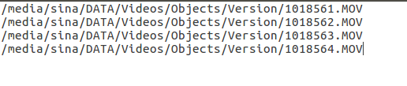

# Rotation of Video using FFMPEG With NVIDIA GPU Acceleration on Ubuntu
---------------------------------------------------------------------

This tutorial deals with video rotation using GPU accelerated libraries
supported by FFMPEG in Ubuntu 16.04.
<!--    #######################  ####################### ####################### #######################            -->
<!--    #######################  ####################### ####################### #######################            -->
<!--    #######################  ####################### ####################### #######################            -->
<!--    #######################  ####################### ####################### #######################            -->
## Introduction
------------

**FFmpeg** is one of the most famous multimedia frameworks wich is
widely used for processeing videos. In order to encode the video,
certainly a video encoder must be used. The popular
`x264` is the one which is widely used however it is not
super fast! The lastest `NVIDIA GPUs` contain a
hardware-based video encoder called `NVENC` which is much
faster than traditional ones. In order to be able to utilize this
gpu-accelerated encoder, FFmpeg must be installed with NVENC support.
The full documentation of FFmpeg integrated with NVIDIA can be fount at
[here](https://developer.nvidia.com/ffmpeg). documentation on NVENC can
be found
[here](https://developer.nvidia.com/nvidia-video-codec-sdk#NVENCFeatures).
Moreover The NVENC programming guide can be found
[here](https://developer.nvidia.com/nvidia-video-codec-sdk#NVENCFeatures).

In this tutorial the main goal is to show how to do video rotation with
GPU-accelerated libraries in Linux. In this tutorial we do not use the
terminal commands directly for employing the FFmpeg with NVENC support.
Instead the python interface is being used to run commands in the
terminal. This can be done using `subprocess` python
module. This module is employed for execution and dealing external
commands, intended to supercede the `os.sys` module. The
trivial method os its usage will be explained in this tutorial. Please
refer to [this
documentation](https://docs.python.org/2/library/subprocess.html) for
further details.

The assumption of this tutorial is that the FFmpeg is already installed
with NVENC support. The installation guide can be found in [FFMPEG WITH
NVIDIA ACCELERATION ON UBUNTU
LINUX](http://developer.download.nvidia.com/compute/redist/ffmpeg/1511-patch/FFMPEG-with-NVIDIA-Acceleration-on-Ubuntu_UG_v01.pdf)
documentation provided by NVIDIA.

## Data Indicator
--------------

This tutorial is customized for processing multiple videos. The
assumption is that the full path of each video is stored in a
`.txt` file in line-by-line format. The example of the
".txt" file is as below:
<p align="center">
  <br>
  <b>Figure 1: The format of .txt file.</b><br>
</p>

As a guidance if a recursive search for specific files in a directory
and its subdirectories with extension `".png"` is
desired, the following method in command line is useful and it saves the
output as a ".txt" file:
```shell
find /absolute/path/to/directory/to/be/search -type f -name
    "\*.png" &gt; /absolute/path/to/save/the/output/textfile.txt
```

## Video Rotation
--------------

From now on the assumption is that the ".txt" file is ready and
well-formatted. The python script for processing videos is as below:
```python
  import subprocess
  import os

  # Pre...
  textfile_path = 'videos.txt'
  output_prefix = 'front'

  # Read the text file line by line.
  with open(textfile_path) as f:
      content = f.readlines()

  # Remove whitespace characters like `\n` at the end of each line
  files_list = [x.strip() for x in content]

  # Transpose 90 degree & Clockwise
  # It already save the video file using the the named defined by output_name.
  for file_num, file_path in enumerate(files_list, start=1):

      # Get the file name with extension
      file_name = os.path.basename(file_path)

      # Get the file name without extension
      raw_file_name = os.path.basename(file_name).split('.')[0]

      # Get the input file directory path.
      file_dir = os.path.dirname(file_path)

      # Form the output file full path.
      output_file_path = file_dir + '/' + output_prefix + '_' + raw_file_name + '.mov'

      print('processing file: %s' % file_path)
      subprocess.call(
          ['ffmpeg', '-i', file_path, '-vf', 'transpose=1', '-vcodec', 'nvenc',
           '-preset', 'slow', '-b:v', '5M',
           '-acodec', 'copy', output_file_path])
      print('file %s saved' % output_file_path)
```

### I - Overall Code Description

The `videos.txt` file is saved in the absolute path.
**Lines 8-13** of the code reads the ".txt" file and stores each line as
an item of a list called `files\_list`. The loop starts
at **line 17** process each file with the
`subprocess.call` command. In each loop the folder of the
input file is found and the output file will be stored in the same
directory but with different naming convention which is explaned by the
comments in the code. Each `,` in the `subprocess.call` command in the python is correspondant
to `an empty space` in the terminal. As an example the
correspondant shell command is as below:
```shell
ffmpeg -i file\_path -filter:v transpose=-1 -vcodec nvenc -preset
    slow -b:v 5M -acodec copy output\_file\_path
```

### II - FFmpeg Encoder

The command executed by **FFmpeg** needs to be described. Each of the
elements started by `-` are calling specific operations
and the command follows by them execute the desired operation. For
example `-vcodec` indicator will specify the **codec** to
be used by **FFmpeg** and **nvenc** which follows by that point to the
codec. More details can be found at [FFmpeg Filters
Documentation](http://ffmpeg.org/ffmpeg-filters.html). The fllowing
Table, summarize the indicators:

| Attribute | Description | option | Description  |
| :-------------: | :-------------: | :-----: | :-----: |
|  -i  | input argument | file\_path | path to the input file |
|  -vf   |   alias for -filter:v  | transpose=1 | clockwise rotation by 90  |
|  -vcodec  |   Set the video codec   |  nvenc |   Nvidia Gpu accelerated library  |
|  -preset  |   increase the quality  | slow |   improves quality  |
|  -b:v      |  set the video bitrate | 5M |   Set to 5M  |
|  -acodec   |  set the audio codec   | copy |   only copied and no encoding  |


The `-vf` is the main command which its full
documentation is available at
[here](https://ffmpeg.org/ffmpeg.html#filter_005foption) and it has the
**filter options**.
## Code Execution
--------------

In order to run the python file we go to the terminal and execute the
following:
```shell
python /absolute/path/to/python/file

```

As a consideration, if we are working on any specific virtual
environment it has to be activated at first.
## Summary
-------

This tutorial demonstrated how to process a video and specifictly
rotating that using **FFmpeg** and Nvidia GPU accelerated library called
**NVENC**. The advantage of using python interface is to easily parse
the **.txt** file and looping through all files. Moreover it enables the
user with options which are more complex to be directly employed in the
terminal environment.

